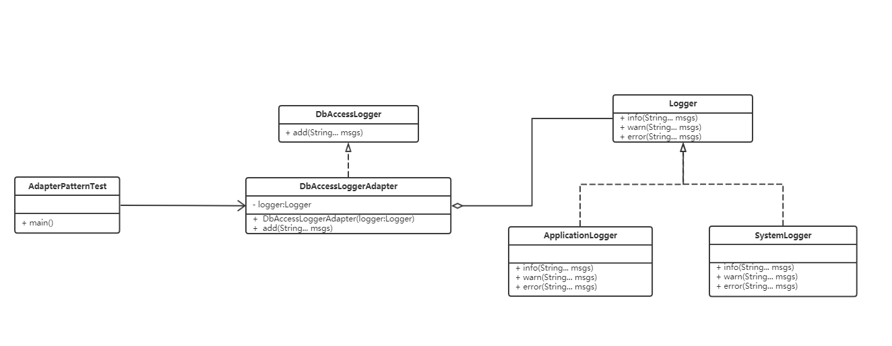

# 适配器模式示例代码

### 1.实现功能概要

  在原有的程序日志，系统日志基础上添加数据库连接的日志出力。

### 2.代码解析

  在数据库连接日志的接口实现类里引用日志接口，使得原本由于接口不兼容而不能一起工作的那些类可以一起工作。
 
#### 2.1 日志接口
```
/**
 * 日志
 */
public interface Logger {

	/**
	 * 记录情报日志
	 * 
	 * @param msgs 日志内容
	 */
	public void info(String... msgs);

	/**
	 * 记录警告日志
	 * 
	 * @param msgs 日志内容
	 */
	public void warn(String... msgs);

	/**
	 * 记录错误日志
	 * 
	 * @param msgs 日志内容
	 */
	public void error(String... msgs);
}
```

#### 2.2 数据库连接日志
```
/**
 * 数据库连接日志
 */
public interface DbAccessLogger {

	/**
	 * 追加日志
	 * 
	 * @param msgs 日志内容
	 */
	public void add(String... msgs);

}
```

#### 2.3 数据库日志适配器
```
/**
 * 数据库日志适配器
 */
public final class DbAccessLoggerAdapter implements DbAccessLogger {

	/**
	 * 日志
	 */
	private Logger logger;

	/**
	 * 构造方法
	 * 
	 * @param logger 日志
	 */
	public DbAccessLoggerAdapter(Logger logger) {
		this.logger = logger;
	}

	/**
	 * @see DbAccessLogger#add(String...)
	 */
	@Override
	public void add(String... msgs) {
		logger.info(msgs);

		StringBuilder logBuilder = new StringBuilder("DbAccess log:");
		for (String msg : msgs) {
			logBuilder.append(",").append(msg);
		}

		System.out.println(logBuilder.toString());

		logger.warn("There is no warnning.");
		logger.error("There is no error.");
	}

}

```

### 3. 类图



