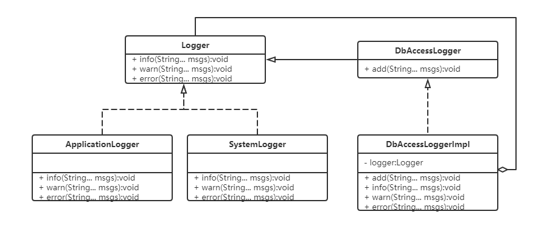

# 装饰器模式示例代码

### 1.实现功能概要

   添加数据库连接日志。并且在数据库连接日志种能记录系统日志或程序日志。

### 2.代码解析
  数据量连接日志类需要继承日志类。在数据量连接日志实现类里需要包含一个日志对象。
 
#### 2.1 日志类
```
/**
 * 日志
 */
public interface Logger {

	/**
	 * 记录情报日志
	 * 
	 * @param msgs 日志内容
	 */
	public void info(String... msgs);

	/**
	 * 记录警告日志
	 * 
	 * @param msgs 日志内容
	 */
	public void warn(String... msgs);

	/**
	 * 记录错误日志
	 * 
	 * @param msgs 日志内容
	 */
	public void error(String... msgs);
}

```

#### 2.2 数据库连接日志
```
/**
 * 数据库连接日志
 */
public interface DbAccessLogger extends Logger{

	/**
	 * 追加日志
	 * 
	 * @param msgs 日志内容
	 */
	public void add(String... msgs);

}
```
###### 2.2.1 数据库连接日志实现类
```
/**
 * 数据库日志实现
 */
public final class DbAccessLoggerImpl implements DbAccessLogger {

	/**
	 * 日志
	 */
	private Logger logger;

	/**
	 * 构造方法
	 * 
	 * @param logger 日志
	 */
	public DbAccessLoggerImpl(Logger logger) {
		this.logger = logger;
	}

	/**
	 * @see DbAccessLogger#add(String...)
	 */
	@Override
	public void add(String... msgs) {
		StringBuilder logBuilder = new StringBuilder("DbAccess log:");
		for (String msg : msgs) {
			logBuilder.append(",").append(msg);
		}

		System.out.println(logBuilder.toString());
	}

	/**
	 * @see Logger#info(String...)
	 */
	@Override
	public void info(String... msgs) {
		logger.info(msgs);
	}

	/**
	 * @see Logger#warn(String...)
	 */
	@Override
	public void warn(String... msgs) {
		logger.warn(msgs);

	}

	/**
	 * @see Logger#error(String...)
	 */
	@Override
	public void error(String... msgs) {
		logger.error(msgs);
	}

}
```
### 3. 类图



