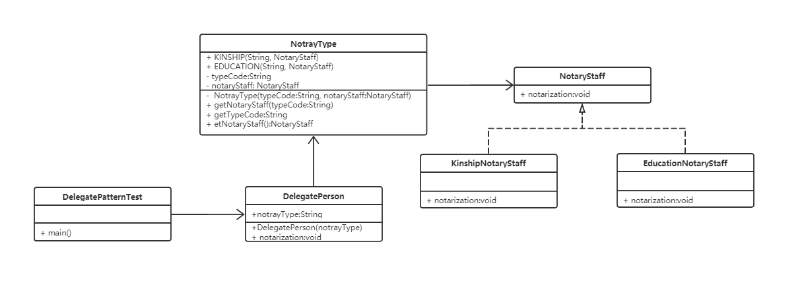

# 委派模式示例代码

### 1.实现功能概要

  办理亲属关系，学历公证。

### 2.代码解析

  学历公证员，亲属关系公证员分别实现公证方法，委派对象引用公证员的公证方法。
  被委派对象根据自己的要求委托人办理公证。
  委派对象的方法名要跟公证员拥有一模一样的方法和属性。

   
 
#### 2.1 公证员接口
```
/**
 * 公证员
 */
public interface NotaryStaff {

	/**
	 * 办理公证
	 */
	public void notarization();
}
```

#### 2.2 公证员实现
###### 2.2.1 EducationNotaryStaff
```
/**
 * 学历公证员
 */
public final class EducationNotaryStaff implements NotaryStaff {

	/**
	 * @see NotaryOffice#notarization()
	 */
	@Override
	public void notarization() {
		System.out.println("为您办理学历公证。");
	}

}

```
###### 2.2.2 KinshipNotaryStaff
```
/**
 * 亲属关系公证员
 */
public final class KinshipNotaryStaff implements NotaryStaff {

	/**
	 * @see NotaryOffice#notarization()
	 */
	@Override
	public void notarization() {
		System.out.println("为您办理亲属关系公证。");
	}

}

```
###### 2.2.3 KinshipNotaryStaff
```
/**
 * 委派对象
 */
public final class DelegatePerson {

	/**
	 * 公证类型
	 */
	private String notrayType;

	/**
	 * 构造方法
	 * 
	 * @param notrayType 公证类型
	 */
	public DelegatePerson(String notrayType) {
		this.notrayType = notrayType;
	}

	/**
	 * 办理公证
	 */
	public void notarization() {
		NotaryStaff notaryOffice = NotrayType.getNotaryStaff(notrayType);
		if (notaryOffice != null) {
			notaryOffice.notarization();
		}
	}
}
```

### 3. 类图



