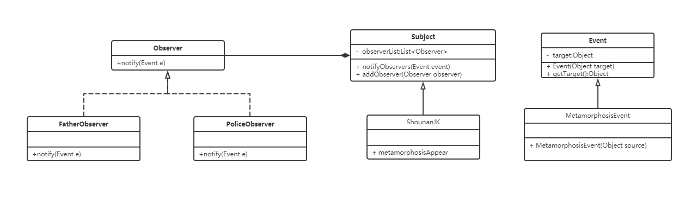

# 观察者模式示例代码

### 1. 实现功能概要
  
     湘南女子高中生被变态骚扰后向警察报警，向父亲求助。

### 2.代码解析

  被观察者需要持有观察者对象一览，有一个向所有观察者通报的方法，当发生一个变态者事件时向所有观察者通报。
  观察者收到观察者的通报后会有一个响应。

   
 
#### 2.1 观察者接口
```
/**
 * 观察者
 */
public interface Observer {
	/**
	 * 通知方法
	 * 
	 * @param e 事件
	 */
	public void notify(Event e);
}

```

#### 2.2 观察者实现
###### 2.2.1 FatherObserver
```
/**
 * 父亲观察者
 */
public final class FatherObserver implements Observer {

	/**
	 * @see Observer#notify(Event)
	 */
	@Override
	public void notify(Event event) {
		System.out.printf("父亲：<%s 求救%n", event.getTarget());
		if (event instanceof MetamorphosisEvent) {
			System.err.println("    --->>>有变态骚扰女儿，马上去救援!!<<<---");
		}
	}

}

```
###### 2.2.2 PoliceObserver
```
/**
 * 警察观察者
 */
public class PoliceObserver implements Observer {

	/**
	 * @see Observer#notify(Event)
	 */
	@Override
	public void notify(Event event) {
		System.out.printf("警察：<%s 报警%n", event.getTarget());
		if (event instanceof MetamorphosisEvent) {
			System.err.println("    --->>>发现一个变态，立刻逮捕!!<<<---");
		}
	}
}
```

#### 2.3 被观察者实现
###### 2.3.1 Subject
```
/**
 * 被观察者
 */
public class Subject {

	/**
	 * 观察者对象一览
	 */
	private List<Observer> observerList = new ArrayList<Observer>();

	/**
	 * 向观察者通报
	 * 
	 * @param event 发生的事件
	 */
	public void notifyObservers(Event event) {
		for (Observer observer : observerList) {
			observer.notify(event);
		}
	}

	/**
	 * 添加观察者
	 * 
	 * @param observer 观察者
	 */
	public void addObserver(Observer observer) {
		observerList.add(observer);
	}
}

```
###### 2.3.2 ShounanJK
```
/**
 * 湘南女子高中生
 */
public final class ShounanJK extends Subject {

	/**
	 * 变态出没
	 */
	public void metamorphosisAppear() {
		MetamorphosisEvent event = new MetamorphosisEvent(this);
		System.out.println("女高:被变态抓住了，谁来救救我！！！");

		notifyObservers(event);
	}
}

```
### 3. 类图



