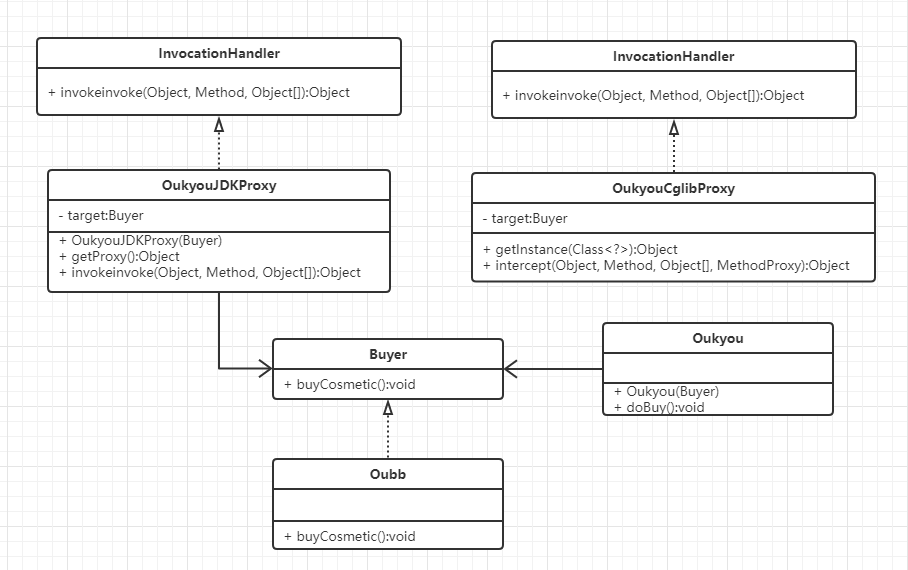

# 代理模式示例代码

### 1. 实现功能概要
  
     代理购买化妆品

### 2. 静态代理模式
#### 2.1 代码解析
  代理对象类里需要定义一个被代理的引用
 
###### 2.1.1 接口
```
/**
 * 买手
 */
public interface Buyer {
	
	/**
	 * 购买化妆品
	 */
	public void buyCosmetic();
}
```

###### 2.1.2 代理类实现
```
/**
 * Oukyou
 */
public final class Oukyou {

	/**
	 * 买手
	 */
	private Buyer buyer;

	/**
	 * 构造方法
	 * 
	 * @param buyer 买手
	 */
	public Oukyou(Buyer buyer) {
		this.buyer = buyer;
	}

	/**
	 * 执行购买
	 */
	public void doBuy() {
		buyer.buyCosmetic();

		System.out.println("我是代购，准备帮你挑选价格便宜的SK2化妆品。");
	}
}
```

### 3. 动态代理模式
#### 3.1 JDK动态代理
###### 3.1.1 代码解析
   代理对象类需要实现InvocationHandler接口，重写invoke方法。通过 Proxy#newProxyInstance方法来获取代理对象。

###### 3.1.2 代理类
```
/**
 * OukyouJDK代理
 */
public final class OukyouJDKProxy implements InvocationHandler {

	/**
	 * 目标对象
	 */
	private Buyer target;

	/**
	 * 构造方法
	 * 
	 * @param buyer 买手
	 */
	public OukyouJDKProxy(Buyer buyer) {
		super();
		this.target = buyer;
	}

	/**
	 * 获取代理
	 * 
	 * @return 代理对象
	 */
	public Object getProxy() {
		return Proxy.newProxyInstance(Thread.currentThread().getContextClassLoader(), target.getClass().getInterfaces(),
				this);
	}

	/**
	 * @see InvocationHandler#invoke(Object, Method, Object[])
	 */
	@Override
	public Object invoke(Object obj, Method method, Object[] args) throws Throwable {
		Object result = method.invoke(target, args);
		System.out.println("我是代购小王，正在为您挑选便宜的货源。");
		return result;
	}

}
```

#### 3.2 Cglib动态代理
###### 3.2.1 代码解析
   代理对象类需要实现MethodInterceptor接口，重写intercept方法。
   因为被代理对象时代理生成的类的父类，所以被代理的对象不能有final修饰。

###### 3.2.2 代理类
```
/**
 * OukyouCglib代理
 */
public final class OukyouCglibProxy implements MethodInterceptor {

	/**
	 * 获取对象实例
	 * 
	 * @param clazz 父类
	 * @return 实例
	 */
	public Object getInstance(Class<?> clazz) {

		Enhancer enhancer = new Enhancer();
		// 设置父类
		enhancer.setSuperclass(clazz);
		enhancer.setCallback(this);

		return enhancer.create();

	}

	/**
	 * @see MethodInterceptor#intercept(Object, Method, Object[], MethodProxy)
	 */
	@Override
	public Object intercept(Object o, Method method, Object[] objects, MethodProxy methodProxy) throws Throwable {
		methodProxy.invokeSuper(o, objects);
		System.out.println("我是代购小王，正在为您挑选便宜的货源。");
		return null;
	}
}

```

### 3. 类图




