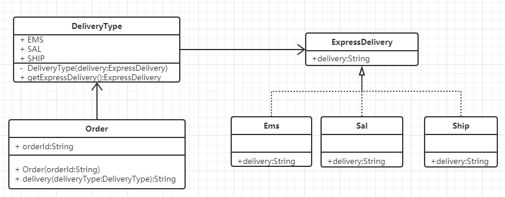

# 策略模式示例代码

### 1. 实现功能概要

     选择不同的物流，并返回物流结果。

### 2. 代码解析
   策略模式需要定一个接口，在不同的实现类里面实现。调用方只需要根据自己的业务需求选择即可。
 
#### 2.1 接口
```
/**
 * 配送
 * 
 * @return 配送结果
 */
public String delivery();
```

#### 2.2 接口实现
###### 2.2.1 EMS类
```
/**
 * @see ExpressDelivery#delivery()
 */
@Override
public String delivery() {
	System.out.println("欢迎使用EMS，预计3天后到达目的地。");
	return "已经到达目的地。";
}
```
###### 2.2.2 SAL类
```
/**
 * @see ExpressDelivery#delivery()
 */
@Override
public String delivery() {
	System.out.println("欢迎使用SAL，预计2周后到达目的地。");
	return "已经到达目的地海关，正在准备通关手续。";
}
```
###### 2.2.3 SHIP类
```
/**
 * @see ExpressDelivery#delivery()
 */
@Override
public String delivery() {
	System.out.println("欢迎使用海运，预计一个月后到达目的地。");
	return "目前货物还在海上，请耐心等待。";
}
```

#### 2.3 出力结果
```
欢迎使用EMS，预计3天后到达目的地。
订单ID:20180312194058253的快递状态是已经到达目的地。
--------------------
欢迎使用SAL，预计2周后到达目的地。
订单ID:20180312194058253的快递状态是已经到达目的地海关，正在准备通关手续。
--------------------
欢迎使用海运，预计一个月后到达目的地。
订单ID:20180312194058253的快递状态是目前货物还在海上，请耐心等待。
```

### 3. 类图


