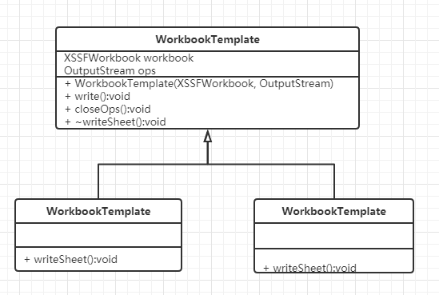

# 模板模式示例代码

### 1.实现功能概要

     根据需求出力相对应的EXCEL文件。

### 2.代码解析
   WorkbookTemplate类定义了出力的抽象方法，明细EXCEL文件的出力内容是在DetailWorkbook里面实现，统计EXCEL文件的处理内容是在TotlaWorkbook里面实现。
 
#### 2.1 父类抽象方法
```
	/**
	 * 出力工作薄
	 * 
	 * @param ops 出力流
	 * @throws IOException IO例外
	 */
	public abstract void write(OutputStream ops) throws IOException;
```

#### 2.2 子类实现
###### 2.2.1 DetailWorkbook
```
	/**
	 * @throws IOException
	 * @see WorkbookTemplate#write()
	 */
	@Override
	public void write(OutputStream ops) throws IOException {
		// 获取第一个sheet
		XSSFSheet sheet = workbook.getSheetAt(0);
		XSSFRow row = sheet.getRow(0);
		XSSFCell cell = row.getCell(0);
		cell.setCellValue("我是详细表头。");

		workbook.write(ops);
		System.out.println("详细表出力完成。");
	}
```
###### 2.2.2 TotalWorkbook
```
	/**
	 * @see WorkbookTemplate#write()
	 */
	@Override
	public void write(OutputStream ops) throws IOException {
		// 获取第一个sheet
		XSSFSheet sheet = workbook.getSheetAt(0);
		XSSFRow row = sheet.getRow(0);
		XSSFCell cell = row.getCell(0);
		cell.setCellValue("我是汇总表头。");

		workbook.write(ops);
		System.out.println("汇总表出力完成。");
	}
```
#### 2.3 出力结果
###### 2.3.1 详细EXCEL文件


###### 2.3.2 汇总EXCEL文件


### 3. 类图



